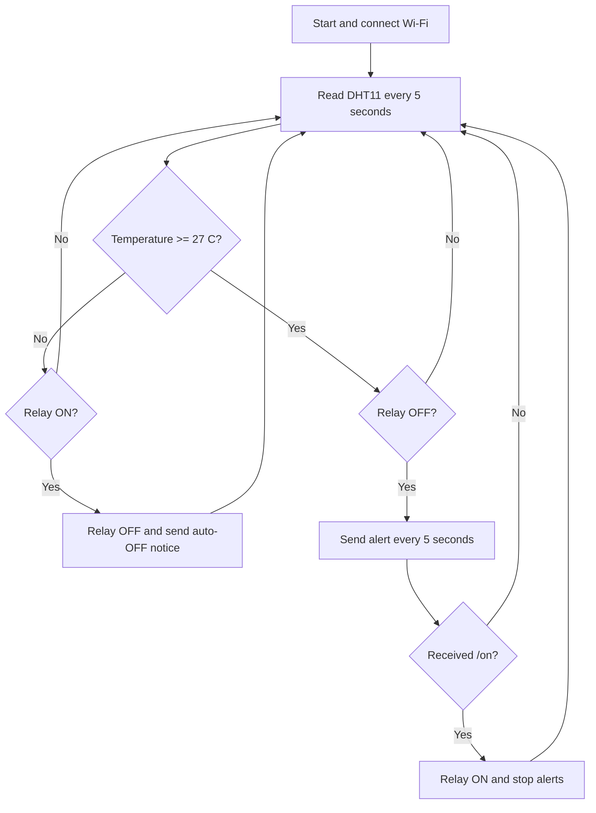

# LAB1: Temperature Sensor with Relay Control (Telegram)

## Group Information

- **Course:** Introduction to Internet of Things
- **Lab:** LAB1 – Temperature Sensor with Relay Control (Telegram)
- **Group:** Group 6
- **Members:**
  - Puthcambo (p.camboeav@gmail.com)
  - Add other group members here

## Project Overview

This project uses an ESP32, DHT11 temperature and humidity sensor, relay module, Wi-Fi, and Telegram Bot API. The ESP32 reads the sensor every five seconds, allows users to check the system and control the relay through Telegram commands, sends repeated high-temperature alerts, and turns the relay off automatically after the temperature becomes safe.

## Equipment

- ESP32 development board with MicroPython
- DHT11 sensor
- Relay module (or onboard LED indicator)
- Jumper wires
- USB cable and laptop with Thonny
- Wi-Fi connection
- Telegram bot and group

## Wiring

| Component | Component pin | ESP32 connection |
|---|---|---|
| DHT11 | VCC | 5V / 3.3V |
| DHT11 | DATA | GPIO 33 |
| DHT11 | GND | GND |
| Relay | VCC | 5V / 3.3V |
| Relay | IN | GPIO 2 |
| Relay | GND | GND |

### Wiring Diagram

Upload the diagram as `evidence/wiring-diagram.png`.


### Actual Wiring Photo

Upload the real hardware photo as `evidence/actual-wiring.jpg`.


---

## Task 1 — Sensor Read and Print (10 points)

### Requirement

Read the DHT11 temperature and humidity every five seconds and print both values with formatting in the Thonny Shell.

### Expected Output

```text
Check (every 5s) -> Temp: 27 °C | Relay ON: False
---------------------------
```

### Task 1 Evidence

Upload the Thonny serial screenshot as `evidence/task1-sensor-reading.png`.


---

## Task 2 — Telegram Send (15 points)

### Requirement

Implement the `send_telegram()` function and use the ESP32 to send a message to the Telegram group.

### Expected Telegram Message

```text
ESP32 is online! Send /temp to get readings.
```

### Task 2 Evidence

Upload the Telegram test screenshot as `evidence/task2-telegram-message.png`.


---

## Task 3 — Telegram Bot Commands (15 points)

### Requirement

The Telegram bot supports commands from the group:

- `/temp` — replies with the current temperature and humidity.
- `/on` — turns the relay ON.
- `/off` — turns the relay OFF.

### Expected Command Results

```text
/temp
Current Temp: 27 °C | Humidity: 45 %

/on
Relay turned ON. Temperature alerts stopped.
```

### Task 3 Evidence

Upload screenshot showing commands as `evidence/task3-bot-commands.png`.


---

## Task 4 — Automatic Temperature and Relay Control (30 points)

### Requirement

- When the temperature is below 27°C, the system sends no automatic alert.
- When the temperature is 27°C or higher and the relay is OFF, the bot sends an alert every five seconds.
- Alerts continue until the `/on` command is received.
- After `/on`, the relay turns ON and the repeated alerts stop.
- When the temperature drops below 27°C, the relay turns OFF automatically.
- The bot sends one automatic OFF notification.

### Task 4 High-Temperature Evidence

Upload the repeated-alert screenshot as `evidence/task4-high-temperature-alerts.png`.


### Task 4 Relay ON Evidence

Upload the screenshot showing `/on` and stopped alerts as `evidence/task4-relay-on.png`.


### Task 4 Automatic OFF Evidence

Upload the automatic OFF screenshot as `evidence/task4-auto-off.png`.


### Task 4 Demonstration Video

The 60–90 second video demonstrates:

1. Normal temperature below threshold.
2. Heating the sensor to trigger high-temperature alert.
3. Repeated Telegram alerts while the relay is OFF (every 5 seconds).
4. Sending `/on` and activating the relay.
5. Alerts stopping after `/on`.
6. Cooling the sensor below the threshold.
7. The relay turning OFF automatically with one notification.

**Video link:** [Watch the demonstration video](PASTE_GOOGLE_DRIVE_OR_YOUTUBE_LINK_HERE)

If uploading directly to repository:
```markdown
[Download the demonstration video](evidence/task4-demonstration.mp4)
```

---

## Task 5 — Documentation (30 points)

### Configuration Steps

1. Flash MicroPython firmware onto the ESP32.
2. Open Thonny and select the MicroPython ESP32 interpreter.
3. Connect the DHT11 DATA pin to GPIO 33.
4. Connect the relay IN pin to GPIO 2.
5. Enter the Wi-Fi credentials, Telegram bot token, and group chat ID in `main.py` (or `config.py`).
6. Upload `main.py` to the ESP32 and run.

### System Flowchart



### Telegram Usage

| Command | Function |
|---|---|
| `/temp` | Show current temperature and humidity |
| `/on` | Turn the relay ON and stop high-temperature alerts |

---

## Source Files

- `lab1/main.py` — complete MicroPython program.
- `lab1/config.example.py` — safe example configuration.
- `lab1/README.md` — documentation, diagrams, results, and video links.
- `lab1/evidence/` — screenshots, wiring photos, and demonstration video.

## Evidence Checklist

- [ ] Task 1 serial screenshot (`evidence/task1-sensor-reading.png`)
- [ ] Task 2 Telegram test-message screenshot (`evidence/task2-telegram-message.png`)
- [ ] Task 3 Telegram commands screenshot (`evidence/task3-bot-commands.png`)
- [ ] Task 4 repeated-alert screenshot (`evidence/task4-high-temperature-alerts.png`)
- [ ] Task 4 relay-ON screenshot (`evidence/task4-relay-on.png`)
- [ ] Task 4 automatic-OFF screenshot (`evidence/task4-auto-off.png`)
- [ ] Wiring diagram (`evidence/wiring-diagram.png`)
- [ ] Actual wiring photo (`evidence/actual-wiring.jpg`)
- [ ] 60–90 second demonstration video link
